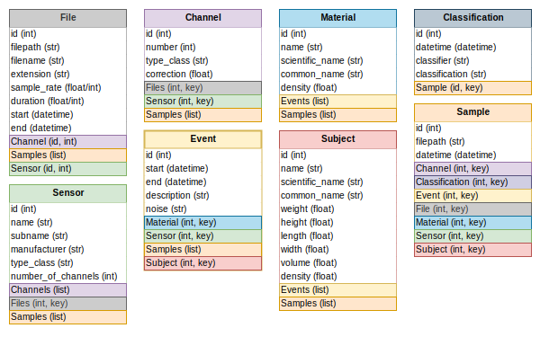

# Models 

The SPIDB package expands on the [SONICDB](https://github.com/dkadyrov/sonicdb) package to include additional models for the dataset. The `SONICDB` package uses the `sqlalchemy` library to interact with a database which is currently a SQLite database. The following figure shows the database schema for the SPID dataset. 

## Event

The `Event` model represents an event in the dataset and was extended from the `SONICDB` model to include information on the noise and material of the recording. An event is a recording of a stored product insect at a specific life stage within a material under a specific level of noise. The `Event` model has the following attributes:

- id (Integer): Unique identifier for the event
- start (DateTime): Start time of the event
- end (DateTime): End time of the event
- description (String): Description of the event
- noise (String): Level of noise during the event
- Material (Int, Key): Foreign key to the Material model
- Subject (Int, Key): Foreign key to the Subject model
- Samples (List): List of samples associated with the event

## Material

The `Material` model represents the material in which the event was recorded. The `Material` model has the following attributes:

- id (Integer): Unique identifier for the material
- name (String): Name of the material
- scientific_name (String): Scientific name of the material
- common_name (String): Common name of the material
- density (Float): Density of the material
- events (List): List of events associated with the material
- samples (List): List of samples associated with the material

## Subject

The `Subject` model represents the subject of the event. The `Subject` model was expanded from the `SONICDB` model to include information on the insect subjects of the dataset. The `Subject` model has the following attributes:

- id (Integer): Unique identifier for the subject
- name (String): Name of the subject
- scientific_name (String): Scientific name of the subject
- common_name (String): Common name of the subject
- life_stage (String): Life stage of the subject
- weight (Float): Weight of the subject
- height (Float): Height of the subject
- length (Float): Length of the subject
- width (Float): Width of the subject
- volume (Float): Volume of the subject
- density (Float): Density of the subject
- events (List): List of events associated with the subject
- samples (List): List of samples associated with the subject

## Sample

The `Sample` model represents a sample in the dataset. The `Sample` model was extended from the `SONICDB` model to include information on the samples of the dataset. The `Sample` model has the following attributes:

- id (Integer): Unique identifier for the sample
- filepath (String): Filepath to the sample
- datetime (DateTime): Date and time of the sample
- Channel (Int, Key): Foreign key to the Channel model
- Classification (Int, Key): Foreign key to the Classification model
- Event (Int, Key): Foreign key to the Event model
- File (Int, Key): Foreign key to the File model
- Material (Int, Key): Foreign key to the Material model
- Sensor (Int, Key): Foreign key to the Sensor model
- Subject (Int, Key): Foreign key to the Subject model
